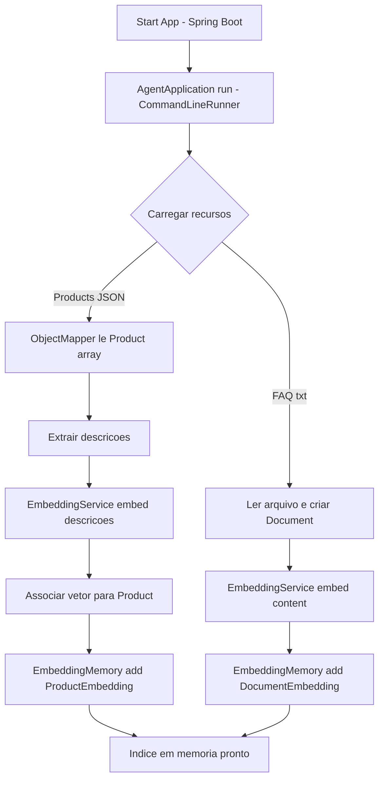
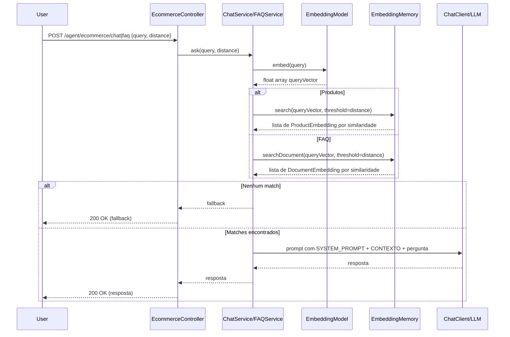

```mermaid
flowchart TB
  A[Start App - Spring Boot] --> B[AgentApplication run - CommandLineRunner]
  B --> C{Carregar recursos}
  C -->|Products JSON| D[ObjectMapper le Product array]
  D --> E[Extrair descricoes]
  E --> F[EmbeddingService embed descricoes]
  F --> G[Associar vetor para Product]
  G --> H[EmbeddingMemory add ProductEmbedding]
  C -->|FAQ txt| I[Ler arquivo e criar Document]
  I --> J[EmbeddingService embed content]
  J --> K[EmbeddingMemory add DocumentEmbedding]
  H --> L[Indice em memoria pronto]
  K --> L
```

```mermaid
sequenceDiagram
  participant User as User
  participant Controller as EcommerceController
  participant Service as ChatService/FAQService
  participant EmbModel as EmbeddingModel
  participant Memory as EmbeddingMemory
  participant LLM as ChatClient/LLM

  User->>Controller: POST /agent/ecommerce/chat|faq {query, distance}
  Controller->>Service: ask(query, distance)
  Service->>EmbModel: embed(query)
  EmbModel-->>Service: float array queryVector
  alt Produtos
    Service->>Memory: search(queryVector, threshold=distance)
    Memory-->>Service: lista de ProductEmbedding por similaridade
  else FAQ
    Service->>Memory: searchDocument(queryVector, threshold=distance)
    Memory-->>Service: lista de DocumentEmbedding por similaridade
  end
  alt Nenhum match
    Service-->>Controller: fallback
    Controller-->>User: 200 OK (fallback)
  else Matches encontrados
    Service->>LLM: prompt com SYSTEM_PROMPT + CONTEXTO + pergunta
    LLM-->>Service: resposta
    Service-->>Controller: resposta
    Controller-->>User: 200 OK (resposta)
  end
```
